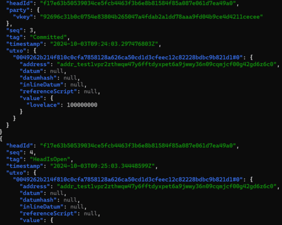

# Hydra Explorer

Hydra Explorer is an open-source tool that parses and presents data from a Hydra node, offering a web-based interface and an API. Currently, Hydra Heads present challenges for developers due to the raw, unstructured log data, lack of visualization tools, and complex debugging processes. The following screenshot (see Figure 1) displays a typical log output from a Hydra node. As can be seen, the log is presented as a continuous stream of text-based data, showing events in the order they occur. While this format captures all the necessary information, it is difficult to interpret at a glance. Developers must manually search through the logs to identify relevant events such as transaction commitments or state changes, which can be time-consuming and prone to error, particularly when multiple Hydra Heads are involved. Hydra Explorer addresses this by offering a clean, user-friendly dashboard that visualizes Hydra Head events in real time. This visual representation of key events allows users to track what’s happening in the Hydra Head much more efficiently than by manually parsing raw logs. With an intuitive visual display, developers can instantly see the state of the system, reducing the cognitive load of interpreting text-based outputs and speeding up the workflow.



From a debugging perspective, the challenges of raw log data become even more apparent. Logs typically present every event in a linear, unstructured format without emphasizing the most important information. This makes it difficult to quickly grasp the system’s current state or understand the sequence of events that led to a particular point. Furthermore, since logs are often lengthy and cluttered, it requires considerable effort to trace through the history of events to understand the broader context. Hydra Explorer simplifies this process by structuring the logs and presenting the relevant data visually, allowing developers to quickly gain an overview of the system’s state and monitor events in an efficient, streamlined way. This reduces the time spent digging through unstructured log files and makes understanding and interacting with the Hydra Head more efficient.

## Running without a Hydra node

It's possible to run the application in a dry mode without an underlying hydra node connection. That might be useful to
test the application out. To do that copy the seed database into the place of the actual one and set a DRY_RUN env
variable:

```sh
cp priv/repo/seeds.dev.sqlite3 priv/repo/dev.sqlite3
cp priv/repo/seeds.dev.sqlite3-shm priv/repo/dev.sqlite3-shm
cp priv/repo/seeds.dev.sqlite3-wal priv/repo/dev.sqlite3-wal
mix deps.get
DRY_RUN=t mix phx.server
```

Navigate to http://localhost:4000/log

## Running a Hydra node

Get a Hydra node up and running:
https://hydra.family/head-protocol/unstable/docs/tutorial/
After that run the application:

```
mix deps.get
mix phx.server
```

Navigate to http://localhost:4000/log

## Running tests

```sh
mix deps.get
mix test
```

All the exposed API endpoint are tested against a golden test database.

## Hydra Node API

https://hydra.family/head-protocol/unstable/api-reference

The Hydra node exposes a few http endpoints and a websocket connection. The only http endpoint that exposes data useful
for presentation purposes is the /protocol-parameters that exposes the protocol parameters the Hydra node was
configured with. Unfortunately, nothing useful for querying aside from the protocol parameters is exposed via the http
api, so to get the actual data out developers would need to establish a websocket connection and do the aggregation
themselves.

In particular, the exposed protocol parameters are:

- collateral percentage
- execution unit prices
- max block sizes
- max block execution units
- max tx execution units
- max tx size
- utxo cost per byte
- cost models
- max collateral inputs
- min pool cost
- monetary expansion
- pool pledge influence
- pool retire max epoch
- stake address deposit
- stake pool deposit
- stake pool target number
- treasury cut
- tx fee fixed
- tx fee per byte
- protocol version

We expose them via the lib/hydra_explorer/protocol_params.ex module.

The WebSocket is the main source of data for the explorer. It sends new frames with messages each time an event happens inside the Hydra Head. These events represent different scenarios, such as initializing the Hydra Head, committing or decommitting from it, and more. Normally, developers have to connect to the WebSocket to obtain text output related to these scenarios and parse the data themselves to extract relevant information for viewing the scenarios they are interested in. Hydra Explorer eliminates this additional complexity by handling the connection, parsing the data, and presenting it in a user-friendly, nicely formatted Web UI. The following message tags are available:

- Greetings
- PeerConnected
- PeerDisconnected
- PeerHandshakeFailure
- HeadIsInitializing
- Committed
- HeadIsOpen
- HeadIsClosed
- HeadIsContested
- ReadyToFanout
- HeadIsAborted
- HeadIsFinalized
- TxValid
- TxInvalid
- SnapshotConfirmed
- GetUTxOResponse
- InvalidInput
- PostTxOnChainFailed
- CommandFailed
- IgnoredHeadInitializing
- DecommitInvalid
- DecommitRequested
- DecommitApproved
- DecommitFinalized

Each one of them may carry some useful data, the parsing of those is located in the lib/hydra_explorer/message.ex
module. The exact exposed data is partially documented in the Hydra docs. Only the documented fields are parsed out and
exposed. The most important exposed parts are committed utxos, valid transactions and connected peers. More messages can
be handled and exposed separately once enough community feedback is collected on the actual needs of developers.

The most important parts are exposed with dedicated pages that follow the conventional blockchain explorer UI where
possible. The whole log is always available on the /log page. The following pages present the important aggregated data:

- /transactions - for all valid transactions
- /committed - for all utxos committed to the Hydra node
- /peers - for all currently connected peers
- /snapshots - for all valid snapshots
- /protocol_params - for the protocol parameters of the Hydra node
- /log - for the raw log

This application exposes an http API with access to the same data that is available in the UI:

- /api/transactions - for all valid transactions
- /api/committed - for all utxos committed to the Hydra node
- /api/peers - for all currently connected peers
- /api/snapshots - for all valid snapshots
- /api/protocol_params - for the protocol parameters of the Hydra node
- /api/log - for the raw log

The Hydra node replays the whole websocket log on connection by default, so the explorer can avoid storing anything in a
database. During the lifetime of the Hydra node different actions can happen, each one of those generates a
corresponding websocket frame that is sent to the explorer. This application collects and processes them on the fly and
presents the data through a convenient UI. The only thing that needs to be processed differently is the protocol
parameters. They are fetched from the node's http endpoint on startup and cached for the lifetime of the explorer.

## Code structure

This repo provides an Elixir/Phoenix backend with a LiveView frontend. It uses sqlite3 as a database, but messages
aren't persisted automatically. The main purpose of the database is to load data for tests/dry-runs.

This choice of technologies allows for a straightforward implementation that streams the new messages, and that allows
for nearly instantaneous display of the events on the node.

We have a few files that deal with the Hydra websocket connection and data extraction

- lib/hydra_explorer/head.ex is a GenServer responsible for the websocket connection with the Hydra node; it decodes
  messages and pushes them to the message store
- lib/hydra_explorer/message_store.ex is a GenServer that stores and broadcasts the Hydra messages to the hydra_head
  queue
- lib/hydra_explorer/protocol_params.ex in an Agent that fetches and exposes the protocol parameters of the Hydra node
- lib/hydra_explorer/tx.ex, lib/csl.ex are used to parse the tx cbor into a usable format, we're using rust's cardano
  serialization library for this, the actual rust code is in the native/csl submodule

The following files prepare the data for the FE and manipulate websocket connections with the FE client:

- lib/hydra_explorer_web/router.ex for the routes definition
- lib/hydra_explorer_web/controllers/messages.ex for the message log API
- lib/hydra_explorer_web/components/layout/app.html.heex for the navigation bar
- lib/hydra_explorer_web/components/explorer_components.ex for some common component templates
- lib/hydra_explorer_web/live/log.{ex, html.heex} for the whole websocket log
- lib/hydra_explorer_web/live/peers.{ex, html.heex} for the connected peers
- lib/hydra_explorer_web/live/snapshots.{ex, html.heex} for the processed snapshots
- lib/hydra_explorer_web/live/transactions.{ex, html.heex} for the valid transactions
- lib/hydra_explorer_web/live/protocol_params.{ex, html.heex} for the Hydra network parameters

As we don't get any blocks data from the Hydra node, we can only show transactions in isolation.

## Hydra Head Architecture

To fully grasp Hydra and its architecture, it is essential to understand that a Hydra Head operates as a Layer 2 state channel built on top of Cardano. This Layer 2 solution is designed to enable a small group of participants to transact off-chain, reducing the load on the main blockchain while maintaining the same level of security and finality. In simple terms, a Hydra Head is like a private, off-chain mini-blockchain where participants can conduct transactions much more quickly and efficiently.

### Participants and Hydra Head Lifecycle

Participants in a Hydra Head open it by committing a portion of their funds to the channel through an initial on-chain transaction. Once the Hydra Head is opened, these participants can exchange off-chain transactions within a collaborative environment. Every transaction inside the Hydra Head is nearly instantaneous, as they occur off-chain without needing to wait for global consensus. Each participant operates a Hydra node, which is responsible for communicating with other nodes to propagate transactions, update the shared off-chain state, and ensure that all participants are synchronized.

The opening of a Hydra Head marks the beginning of this off-chain collaboration. Participants can then send and receive transactions between one another freely, without every action being recorded on the main blockchain. This allows for a high volume of transactions to occur rapidly and with minimal fees, making it an ideal solution for applications that require fast and frequent transactions.

### Communication Between Hydra Nodes

Hydra nodes play a crucial role in maintaining the integrity of the off-chain state. Each node is connected to others, creating a peer-to-peer network that ensures all participants have a consistent view of the off-chain transactions. Nodes propagate transaction data between participants and continuously update the shared state of the Hydra Head. Because this occurs off-chain, transactions are processed almost immediately, greatly improving scalability and performance when compared to on-chain transactions.

### State Channels and Efficiency

At the core of the Hydra Head architecture lies the concept of state channels. A state channel is a private ledger between participants that allows them to perform multiple transactions without burdening the main blockchain. Every participant must agree on any updates to the shared state, ensuring that all parties have a consistent view of the off-chain transactions. These updates are recorded and propagated in real time, ensuring that the latest state is always available to all parties involved.

This system allows transactions to be processed efficiently and securely, as the need for global consensus-like that required for on-chain transactions - is replaced by local consensus between the participants. This provides both speed and scalability, as the main blockchain is only involved in critical actions, like opening or closing the Hydra Head.

### On-Chain Verification and Finality

While most of the interactions within the Hydra Head occur off-chain, certain critical actions must be verified on-chain to maintain the integrity and security of the system. The opening and closing of the Hydra Head, for example, require on-chain transactions. When the Hydra Head is closed, the final state is committed back to the main Cardano blockchain, ensuring that the results of all off-chain transactions are reflected on-chain.

In addition, if any participant wishes to contest the off-chain state during the lifecycle of a Hydra Head, they can trigger an on-chain dispute mechanism. This ensures that no fraudulent or incorrect state updates can occur, as the main blockchain provides an immutable and secure layer of trust.

### Scalability and Security

Hydra’s architecture strikes a balance between scalability and security. The off-chain nature of the Hydra Head allows for a large number of transactions to be processed quickly and efficiently, while the use of on-chain verification ensures that the final state remains accurate and tamper-proof. This makes Hydra particularly well-suited for applications that demand high throughput, while maintaining the security guarantees of Cardano’s main blockchain.

Overall, Hydra Heads allow for fast, scalable, and low-cost transactions without compromising the security and integrity of the blockchain, making it a powerful tool for expanding Cardano’s transaction capabilities. By leveraging off-chain state channels, Hydra enables participants to perform complex and frequent interactions without overwhelming the network, while still benefiting from the robust security and finality of the Cardano blockchain.
